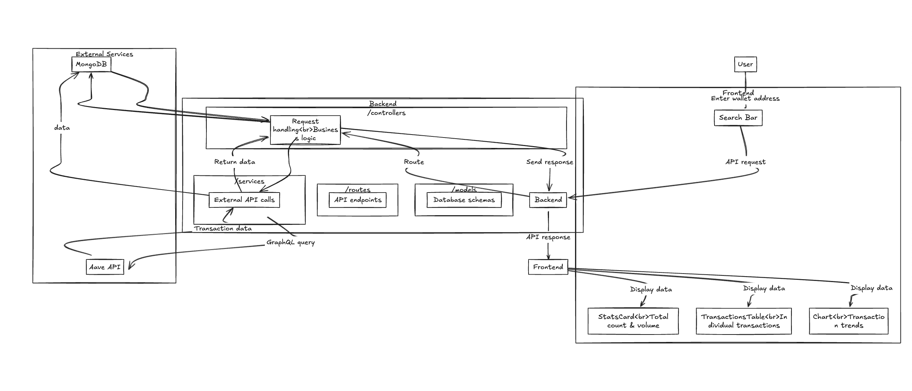

# 🔍 Zeru DeFi Detective

## The Challenge
Develop a DeFi analytics dashboard that helps users investigate their Aave activities. Join us in building tools that make DeFi more transparent and accessible!

## Architecture Overview


The diagram above illustrates the application's architecture:
- Frontend components communicate with the backend via REST API
- Backend controllers handle business logic and data flow
- External services (MongoDB and AAVE API) provide data storage and DeFi data
- Components are organized for scalability and maintainability


## Setup Instructions

### Backend Setup

1. Install dependencies:
```bash
cd backend
npm install
```

2. Configure environment variables:
- Copy `.env.example` to `.env`
- Add your MongoDB URI
- Use mongosh command if you want to run the   database mongodb locally then you will see
either install
show dbs;
to show database 

- Add your AAVE GraphQL API key
- Set port (default: 4000)

```env
MONGODB_URI=mongodb://your-mongodb-uri
PORT=4000
GRAPHQL_API_KEY=your-api-key-here
```

1. Start the server:
```bash
node server.js
```

### Frontend Setup

1. Install dependencies:
```bash
cd frontend
npm install
```

2. Start the development server:
```bash
npm run dev
```

The application will be available at `http://localhost:3000` or it can be run on any port you want

## API Endpoints

### Wallet Transactions
```
GET /api/wallet/:address
```
Returns transaction history for a specific wallet address.

### Wallet Statistics
```
GET /api/wallet/:address/stats
```
Returns total volume and transaction count for a wallet.

## Technology Stack

### Frontend
- Next.js 15 (App Router)
- TypeScript
- Tailwind CSS
- Nivo Charts for showing charts
- Axios

### Backend
- Node.js
- Express
- MongoDB
- Mongoose
- GraphQL (AAVE API)

## Features

### Transaction Tracking
- Real-time wallet search
- Historical transaction data
- Transaction volume visualization
- Asset price tracking

### Data Visualization
- Interactive line charts
- Transaction volume trends
- Asset distribution
- Price history

### User Interface
- Responsive design
- Real-time updates
- Interactive components
- Mobile-friendly layout

## Development Guidelines

### Code Style
- Use TypeScript for type safety
- Follow ESLint configurations
- Implement proper error handling
- Write meaningful comments


### Backend (.env)
```env
MONGODB_URI=mongodb://127.0.0.1:27017/defi-dashboard
PORT=4000
GRAPHQL_API_KEY=your-aave-subgraph-api-key
```


## Contributing

1. Fork the repository
2. Create your feature branch
3. Commit your changes
4. Push to the branch
5. Create a Pull Request

## License

MIT License - See LICENSE file for details

## Support

For support, please open an issue in the repository or contact the maintainers. 